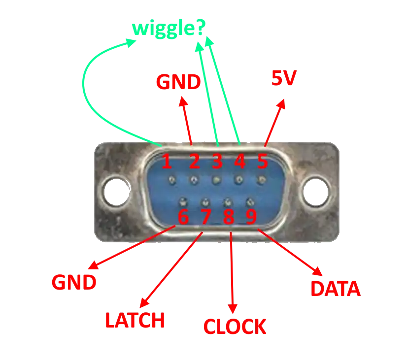

# PowerPoint Glove
Code for DEF CON 33 (2025) Creator Stages, organizedby the wonderful folks of
the Hardware Hacking Village.

Slides: https://github.com/parsiya/Presentations/tree/main/defcon-33-power-glove/

Also see [some random notes](notes.md).

## Hardware

1. Power Glove
2. DB9 Connector
3. ESP32 Compatible board with Bluetooth and 5V tolerant pins.

## Development Options

1. [Arduino IDE](https://www.arduino.cc/en/software/)
2. [ESP-IDF](https://github.com/espressif/esp-idf?tab=readme-ov-file#setting-up-esp-idf)

## Setting Up The Chip
If the ESP32 shows up as `Silicon Labs C210x` in Device Manager, you need to
install the `CP210x Universal Windows Driver` at https://www.silabs.com/developer-tools/usb-to-uart-bridge-vcp-drivers?tab=downloads.

On Windows, do the following an admin PowerShell window:

```
# install usbipd
winget install usbipd

# get a list of devices
usbipd list
```

You will see your board. It might be like one of these choices:

```
1-13   1a86:55d4  USB-Enhanced-SERIAL CH9102 (COM5)     Not shared

1-13   10c4:ea60  Silicon Labs CP210x USB to UART Bridge (COM5)     Not shared
```

The first number `1-13` is the bus ID.

Now you can share it with WSL like this (still in admin cmd):

```
usbipd bind --busid 1-13

usbipd attach --wsl --busid 1-13
```

If you see the following error:

```
usbipd attach --wsl --busid 1-13

usbipd: info: Using WSL distribution 'debian' to attach; the device will be available in all WSL 2 distributions.
usbipd: info: Loading vhci_hcd module.
usbipd: error: Loading vhci_hcd failed.
```

In WSL run the following command and repeat the command `sudo modprobe vhci_hcd`.

In WSL run `dmesg | tail` to see the name of the device. Usually `/dev/ttyACM0`
or `/dev/ttyUSB0`.

## Building and Running
Notice the pinout of the DB9 connector.



The code assumes the pins from the connector are connected to the following ESP32 pins:

```c
// DB9 Pin 7 -> P25 - Latch
#define LATCH GPIO_NUM_25
// DB9 Pin 8 -> P26 - Clock
#define CLOCK GPIO_NUM_26
// DB9 Pin 9 -> P27 - Data
#define DATA GPIO_NUM_27
```

Modify the code accordingly for your board.

Alternatively, you can also change the mappings in code.

### Arduino Code
Arduino code is easier.

1. Install Arduino-ESP32 support
    1. https://docs.espressif.com/projects/arduino-esp32/en/latest/installing.html#installing-using-arduino-ide
2. Install `TriDEntApollO/ESP32-BLE-Keyboard-V2` in Arduino IDE.
    1. https://github.com/TriDEntApollO/ESP32-BLE-Keyboard-V2?tab=readme-ov-file#installation
    2. Do not use the original version. Use this fork.
3. Flash the board, you might have to hold the boot button while flashing.
4. You should see a bluetooth device named `Glove KB`.
5. Pair with it and then use the Power Glove buttons to perform actions.


### esp_hid_glove
PowerGlove to Bluetooth Mouse or Keyboard. Based on
[espressif/esp-idf/esp_hid_device][hid-link] code (Unlicensed by Espressif).

[hid-link]: http://github.com/espressif/esp-idf/blob/master/examples/bluetooth/esp_hid_device/

```
cd esp_hid_glove
idf.py set-target esp32
```

To change the selection between mouse and keyboard, you have two options:

1. Run `idf.py set-target esp32`
2. Run `idf.py menuconfig`
    1. `HID Example Configuration`
    2. `HID Device Role`
    3. `Enable Keyboard Device` or `Enable Mouse Device`
    4. Press `S` to save the config.
    5. If you run `set-target` after this, it will regenerate the config and you have to do this again.
3. Open `sdkconfig.defaults`
    1. Comment/Uncomment the section for mouse or keyboard.
    2. Run `idf.py set-target esp32` to generate the config.

```
# sdkconfig.default

# mouse mode
# CONFIG_EXAMPLE_MOUSE_ENABLE=y
# CONFIG_EXAMPLE_HID_DEVICE_ROLE=3

# keyboard mode
CONFIG_EXAMPLE_KBD_ENABLE=y
CONFIG_EXAMPLE_HID_DEVICE_ROLE=2
```

Now you can flash and monitor. Use the name you saw above in WSL logs.

```
idf.py -p /dev/ttyUSB0|/dev/ttyACM0 flash monitor
```

